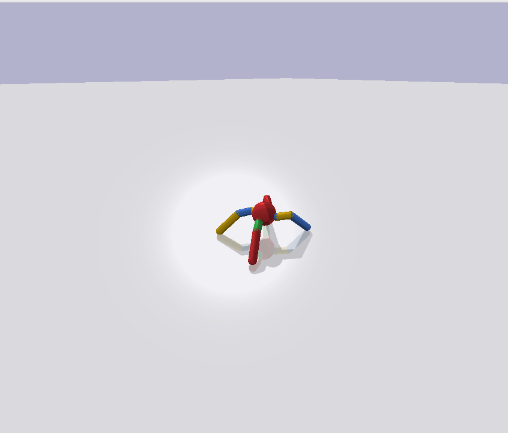

<!-- Improved compatibility of back to top link: See: https://github.com/othneildrew/Best-README-Template/pull/73 -->

<!--
*** Thanks for checking out the Best-README-Template. If you have a suggestion
*** that would make this better, please fork the repo and create a pull request
*** or simply open an issue with the tag "enhancement".
*** Don't forget to give the project a star!
*** Thanks again! Now go create something AMAZING! :D
-->

<!-- PROJECT SHIELDS -->
<!--
*** I'm using markdown "reference style" links for readability.
*** Reference links are enclosed in brackets [ ] instead of parentheses ( ).
*** See the bottom of this document for the declaration of the reference variables
*** for contributors-url, forks-url, etc. This is an optional, concise syntax you may use.
*** https://www.markdownguide.org/basic-syntax/#reference-style-links
-->

<!-- PROJECT LOGO -->
 

  

<h3 align="center">Ant environment RL Experiments</h3>

  

    I am implementing different ideas simple ideas to solve this environment
     
     
     
    
  

## About The Project

I think current RL world is lacking something and it has a lot more potential. I came up with some ideas in this field and currently I want to implement and play with them in summer.`

(<a href="#readme-top">back to top</a>)

(<a href="#readme-top">back to top</a>)

<!-- GETTING STARTED -->
## Progress
 The third version can finally walk but it is really weird! It walks like this:
  
For the fourth version I want to add memory to the joints.

